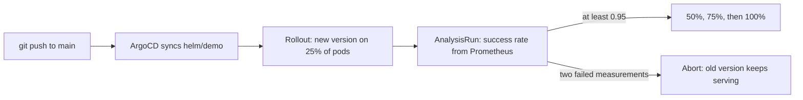

# Stackup

Stackup brings up a single-node Kubernetes cluster on a laptop with one command. kind runs the cluster inside Docker, and ArgoCD keeps it in step with this repository. A small demo service ships through an Argo Rollouts canary: each new version starts on a share of the pods while Prometheus checks the service's HTTP success rate, and the rollout either continues to 100% or rolls back on its own.

[](https://github.com/ykstorm/stackup/actions/workflows/ci.yml)
[](LICENSE)

Documentation site: [ykstorm.github.io/stackup](https://ykstorm.github.io/stackup/) (built from `docs-site/`).

## What gets installed

| Layer | Component | What it does here |
|---|---|---|
| Cluster | kind | One Kubernetes node running as a Docker container |
| Network | Calico | Pod networking and NetworkPolicy enforcement in both directions (kind's default CNI is turned off) |
| GitOps | ArgoCD | A root Application syncs `argocd/apps/`, which defines six child Applications |
| Delivery | Argo Rollouts | Runs the demo's canary steps and its analysis gate |
| Metrics | kube-prometheus-stack | Prometheus and Grafana |
| Ingress | ingress-nginx | Serves `*.localtest.me` on ports 80 and 443 of the host |
| TLS | cert-manager | Issues certificates from a self-signed ClusterIssuer |
| Secrets | Sealed Secrets | Controller that decrypts SealedSecret resources inside the cluster |
| Pod security | Pod Security Admission | The `app` namespace enforces the `restricted` profile |
| Workload | `demo` (`helm/demo`) | Express service that counts every request in `http_requests_total`; the subject of the canary |

The six child Applications are `argo-rollouts`, `cert-manager`, `demo`, `ingress-nginx`, `kube-prometheus-stack` and `sealed-secrets`.

## Prerequisites

- Docker, with at least 6 GB of memory available to it (Docker Desktop: Settings, Resources). Below about 4 GB the controllers crash-loop.
- `kind`, `kubectl`, and `helm` 3.15 or newer.
- The `kubectl-argo-rollouts` plugin, used by `make rollout-status` and `make rollout-ui`.
- `git`, `bash` and `make`. On Windows, run from Git Bash or WSL; without `make`, run `bash scripts/bootstrap.sh`.
- Ports 80 and 443 free on the host. The kind node publishes them for ingress.

## Bring it up

```bash
git clone https://github.com/ykstorm/stackup && cd stackup
make up
```

`make up` runs `scripts/bootstrap.sh`. It creates the kind cluster, installs Calico, then installs the platform charts one at a time and waits for each to be ready. It builds the demo image, loads it into kind, installs the demo chart, and finally applies `argocd/root-app.yaml`. From then on ArgoCD manages everything from git.

## Open

Hostnames under `localtest.me` resolve to `127.0.0.1`, so there is nothing to add to a hosts file. Certificates come from a self-signed issuer, so the browser warns once per host.

- Grafana: [https://grafana.localtest.me](https://grafana.localtest.me). Log in as `admin` / `prom-operator` (the chart's default; this cluster holds no real data).
- The canary dashboard: [https://grafana.localtest.me/d/stackup-canary](https://grafana.localtest.me/d/stackup-canary). It ships with the demo chart (`helm/demo/dashboards/canary.json`) and shows the gate's success-rate query against the 0.95 line, requests by status code, 5xx responses by pod, and ready pods per ReplicaSet.
- ArgoCD: [https://argocd.localtest.me](https://argocd.localtest.me). Log in as `admin`; the password is in a Secret:
  ```bash
  kubectl -n argocd get secret argocd-initial-admin-secret -o jsonpath='{.data.password}' | base64 -d
  ```
- The rollout, in the terminal: `make rollout-status`. In a browser: `make rollout-ui`, which serves the Argo Rollouts dashboard on [http://localhost:3100/rollouts](http://localhost:3100/rollouts) from your machine.
- The demo: [https://demo.localtest.me](https://demo.localtest.me). Its `/metrics` path shows `http_requests_total`:
  ```bash
  curl -k https://demo.localtest.me/metrics
  ```

## Ship a change through the canary

ArgoCD tracks `main` of the repository named in `argocd/root-app.yaml` and `argocd/apps/*.yaml`, which is `ykstorm/stackup`. To deploy from git yourself, fork the repository and replace that URL with your fork's before running `make up`.

1. Build the new image and load it into kind:
   ```bash
   make demo-image DEMO_IMAGE=stackup-demo:v2
   ```
2. Set `image.tag: v2` in `helm/demo/values.yaml`, commit, and push.
3. ArgoCD picks up the commit (it polls every three minutes; Refresh in the UI is faster) and updates the Rollout.
4. Watch it:
   ```bash
   make rollout-status   # kubectl argo rollouts get rollout demo -n app --watch
   ```

The steps come from `helm/demo/templates/rollout.yaml`:

```
setWeight 25 -> pause 30s -> analysis -> setWeight 50 -> pause 30s
             -> setWeight 75 -> pause 30s -> setWeight 100
```

There is no traffic router, so a weight is a share of the pods: with two replicas, the 25% step runs one new pod next to the two old ones.

The analysis step runs the AnalysisTemplate in `helm/demo/templates/analysis-template.yaml`. After a 30-second delay it runs this query against Prometheus three times, 30 seconds apart:

```promql
sum(rate(http_requests_total{service="demo", code=~"2.."}[2m]))
/
sum(rate(http_requests_total{service="demo"}[2m]))
```

A measurement passes when the result is at least 0.95. If two of the three fail, the AnalysisRun fails, Argo Rollouts aborts the update, and the old version keeps serving.

### Watch it roll back

On its own the demo only receives probe and scrape requests, and those always return 200. To see the gate fail, send it real traffic and ship a version that fails part of it:

1. Start two curl pods that call `/api/work` in a loop:
   ```bash
   kubectl apply -f ci/traffic.yaml
   ```
2. Set `failureRate: "0.5"` in `helm/demo/values.yaml` (the new pods fail half of their `/api/work` calls), commit, and push.
3. `make rollout-status` shows the AnalysisRun fail and the rollout stop as `Degraded`, with the old pods still serving.

Revert the commit to bring the Rollout back to `Healthy`, and delete the traffic with `kubectl delete -f ci/traffic.yaml`.

### Checked in CI

[`.github/workflows/canary-e2e.yml`](.github/workflows/canary-e2e.yml) creates a kind cluster on a GitHub runner, installs Argo Rollouts and a small Prometheus, sends steady traffic to the demo, then ships a second image and waits for the canary. The job passes only if the rollout reaches `Healthy` and an AnalysisRun succeeded. The CI values file ([`helm/demo/values.ci.yaml`](helm/demo/values.ci.yaml)) shortens the pauses and the `rate()` window so the run fits a runner; the query and the 0.95 threshold are the same. Last successful run: [2026-07-05](https://github.com/ykstorm/stackup/actions/runs/28745258492).

## Architecture



[docs/architecture.md](docs/architecture.md) covers the cluster, the ArgoCD tree, and the security settings. [docs/gitops.md](docs/gitops.md) covers the app-of-apps layout and the canary in detail.

## Makefile targets

```bash
make help            # list targets
make up              # create the cluster and install everything (scripts/bootstrap.sh)
make down            # delete the kind cluster
make demo-image      # build the demo image and load it into kind (DEMO_IMAGE=stackup-demo:v2 for a new tag)
make lint            # static checks: YAML, shell scripts, chart renders against the schemas (no cluster)
make rollout-status  # watch the demo Rollout in the terminal
make rollout-ui      # Argo Rollouts dashboard on http://localhost:3100/rollouts
```

## Limits

- kind has no LoadBalancer. Ingress uses hostPort 80 and 443 on the single node.
- Nothing is persisted. Prometheus and Grafana use `emptyDir`, and `make down` deletes the cluster.
- The Sealed Secrets controller creates a new key for each cluster, so anything sealed against one cluster will not decrypt on the next.
- One node and one workload namespace. More tenants would need more NetworkPolicy and RBAC work.
- The demo is a stand-in for a real service. It exists so the canary has real request metrics to judge.

## License

Apache License 2.0. See [LICENSE](LICENSE).
