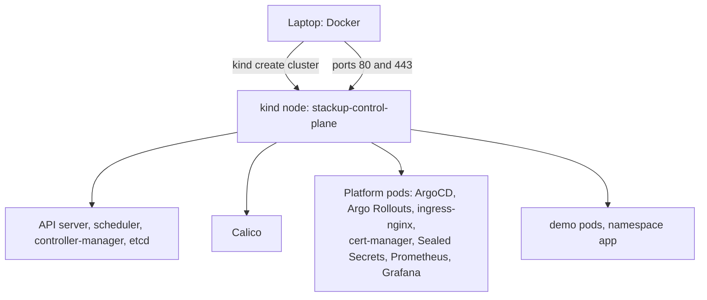
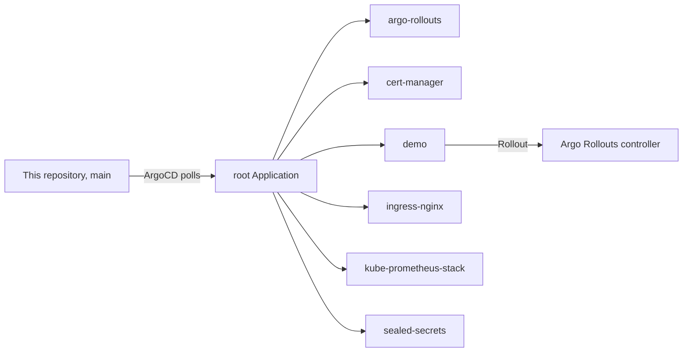
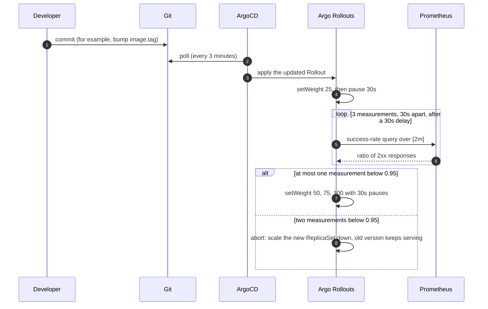

# Architecture

## 1. The cluster



`kind/cluster.yaml` defines one node, a control-plane node that also runs every workload. The node is a Docker container running containerd and the kubelet, so pods are containers inside that container.

The cluster sets `disableDefaultCNI: true`, so kind's own CNI never starts. `scripts/bootstrap.sh` installs Calico through the tigera-operator instead, because Calico enforces both the ingress and the egress half of a NetworkPolicy. The pod subnet is `192.168.0.0/16`, matching `kind/calico/installation.yaml`.

The node publishes ports 80 and 443 to the host (`extraPortMappings`), and ingress-nginx binds them with hostPort. That is how `https://grafana.localtest.me` on the laptop reaches the controller pod.

The whole stack needs about 6 GB of memory for Docker. Below about 4 GB the controllers crash-loop.

| Namespace | What runs there |
|---|---|
| `app` | The demo Rollout. Enforces the `restricted` Pod Security profile. |
| `argocd` | ArgoCD |
| `argo-rollouts` | Argo Rollouts controller |
| `monitoring` | kube-prometheus-stack (Prometheus, Grafana, kube-state-metrics, node-exporter) |
| `ingress-nginx` | ingress-nginx controller |
| `cert-manager` | cert-manager |
| `kube-system` | Sealed Secrets controller, CoreDNS |
| `tigera-operator`, `calico-system`, `calico-apiserver` | Calico |

## 2. The GitOps tree



`argocd/root-app.yaml` points at `argocd/apps/`, and every file there is an Application. Each one syncs automatically with prune and self-heal turned on, so git is the source of truth: a resource removed from git is removed from the cluster, and an edit made with `kubectl` is reverted on the next sync. [gitops.md](gitops.md) lists the source of each child.

## 3. The canary



The query, as `helm/demo/templates/analysis-template.yaml` renders it with the default values:

```promql
sum(rate(http_requests_total{service="demo", code=~"2.."}[2m]))
/
sum(rate(http_requests_total{service="demo"}[2m]))
```

It covers every pod behind the `demo` Service, old and new, so the result is the success rate of the service as a whole while the canary is part of it. [gitops.md](gitops.md) explains the weights and the failure rule in detail.

## 4. Metrics

The demo app (`apps/demo/server.js`) uses prom-client. Every response increments `http_requests_total{service, method, path, code}`, and `GET /metrics` serves it along with the default Node.js process metrics.

The chart's ServiceMonitor has the Prometheus operator from kube-prometheus-stack (release `kps`) scrape `/metrics` every 30 seconds. Grafana reads from that Prometheus and comes with the chart's standard Kubernetes dashboards. There is no alerting and no log or trace pipeline: the stack collects metrics only.

The demo chart adds one dashboard, `helm/demo/dashboards/canary.json` (uid `stackup-canary`), as a ConfigMap that Grafana's sidecar loads. Its top panel runs the gate's query against the 0.95 line, and `make smoke` fails if the two drift apart. The other panels show requests by status code, 5xx responses by pod, and ready pods per ReplicaSet (from kube-state-metrics), so a canary step or an abort is visible as one ReplicaSet gaining pods and another losing them.

Prometheus and Grafana use `emptyDir` volumes, so their data does not survive a pod restart or `make down`.

## 5. Security settings

| Area | Setting |
|---|---|
| Pod admission | The `app` namespace enforces, audits and warns on the `restricted` Pod Security profile (`manifests/app/00-namespace.yaml`). |
| Pods | The demo runs as UID 1001 with a read-only root filesystem, no capabilities, no privilege escalation, the `RuntimeDefault` seccomp profile, and no service account token mounted. |
| Network | Calico enforces NetworkPolicy in both directions. |
| Secrets | The Sealed Secrets controller decrypts SealedSecret resources in the cluster. Its key is created per cluster. |
| TLS | cert-manager issues certificates for each Ingress from the self-signed `selfsigned` ClusterIssuer. |

## 6. What is simplified

- One node and one workload namespace.
- No LoadBalancer. kind does not have one, so ingress uses hostPort.
- No persistence. Nothing survives `make down`.
- Self-signed certificates. Browsers and `curl` need to be told to trust them (`curl -k`).
- No alerting, logs or traces.

## 7. Moving off kind

On a managed cluster (EKS, GKE, AKS) the main changes are:

1. A managed control plane with more than one node.
2. A LoadBalancer Service for ingress-nginx instead of hostPort.
3. An ACME ClusterIssuer (DNS-01) instead of the self-signed one.
4. Persistent volumes for Prometheus and Grafana.
5. A backup of the Sealed Secrets key, so sealed values survive a rebuilt cluster.
6. A traffic router (an ingress controller integration or a service mesh), so canary weights are exact shares of traffic rather than pod counts.
